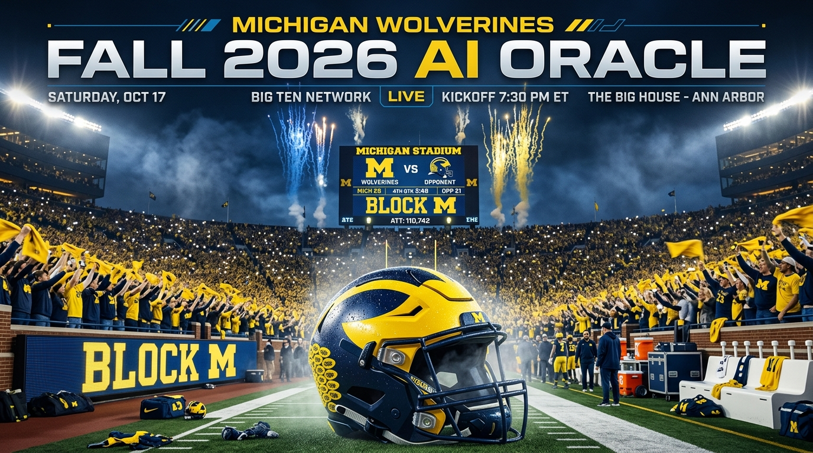

# 〽️ Michigan Wolverines 2026 Football Season Predictor & AI Oracle

A mobile-first college football prediction engine and Monte Carlo drive simulator for the **Michigan Wolverines' Fall 2026 Season**.



## 🏈 Features
- **Official Fall 2026 Schedule**: 12 games including Oklahoma (Week 2 at The Big House), Penn State, Michigan State (Paul Bunyan Trophy), at Oregon (Autzen Stadium), and at Ohio State (*The Game* in Columbus).
- **Realistic 9-3 Baseline Analytics**: Realistic Big Ten modeling under Sherrone Moore, Bryce Underwood, Jordan Marshall, and Wink Martindale's defense.
- **Dynamic Simulation Engine**: Adjust sliders for Bryce Underwood QB form, Smashmouth RBs, Front-Seven Sacks, and Big House 110k+ crowd decibels.
- **12-Team CFP Playoff Gauntlet**: Live round-by-round tournament path visualizer (Rose Bowl, Peach Bowl, National Championship).
- **Gameday Hype Card Generator**: Canvas-rendered graphic cards with native iOS/Android sharing for group chats.

## 🚀 Deployment Instructions for GitHub Pages
1. Create a new GitHub repository named `michigan-football-predictor` under your GitHub account.
2. In your terminal, run:
   ```bash
   cd /Users/jakejohnson/michigan-football-predictor
   git init
   git add .
   git commit -m "Initial commit for Michigan Football 2026 Predictor"
   git branch -M main
   git remote add origin git@github.com:jajo9147/michigan-football-predictor.git
3. In GitHub repo Settings -> Pages -> Source: Deploy from branch `main` / `(root)`.

---

## 👨‍💻 Creator & Owner
**Jake Johnson**
- LinkedIn: [https://www.linkedin.com/in/jake-johnson-/](https://www.linkedin.com/in/jake-johnson-/)
- GitHub Portfolio: [https://jajo9147.github.io/](https://jajo9147.github.io/)

